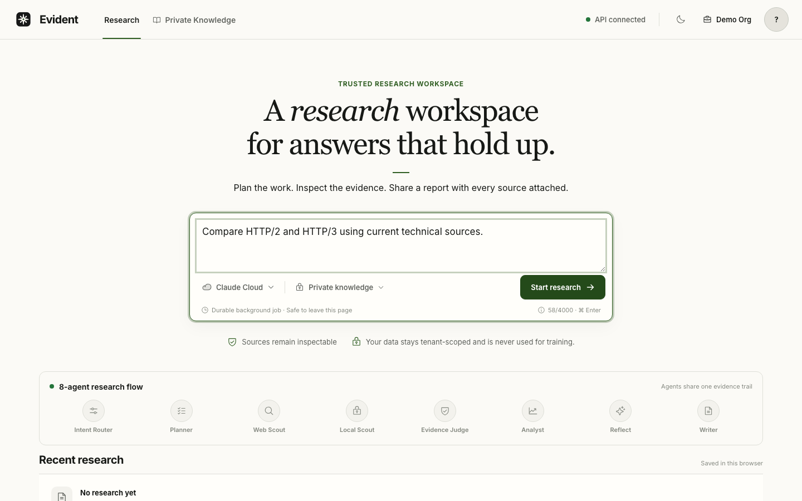
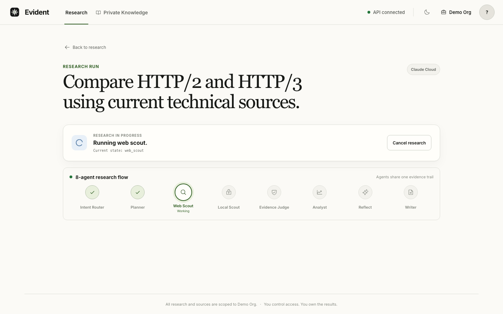
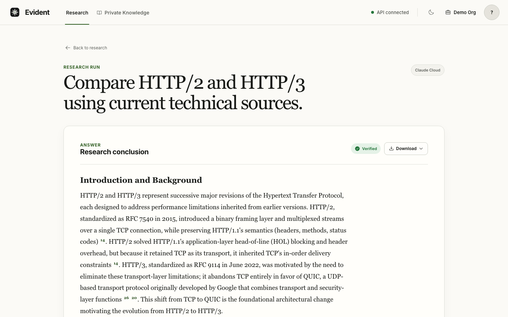
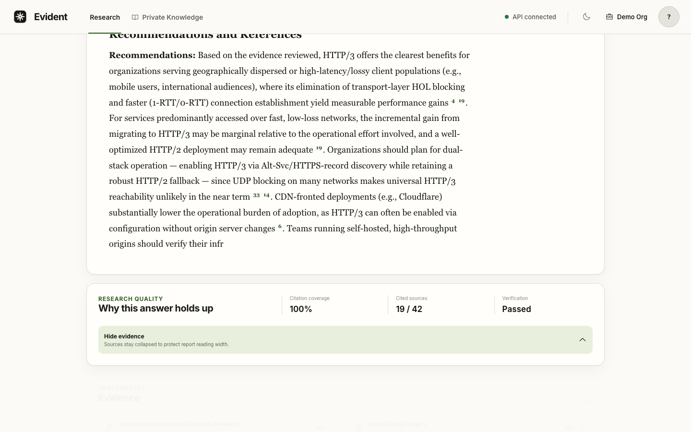
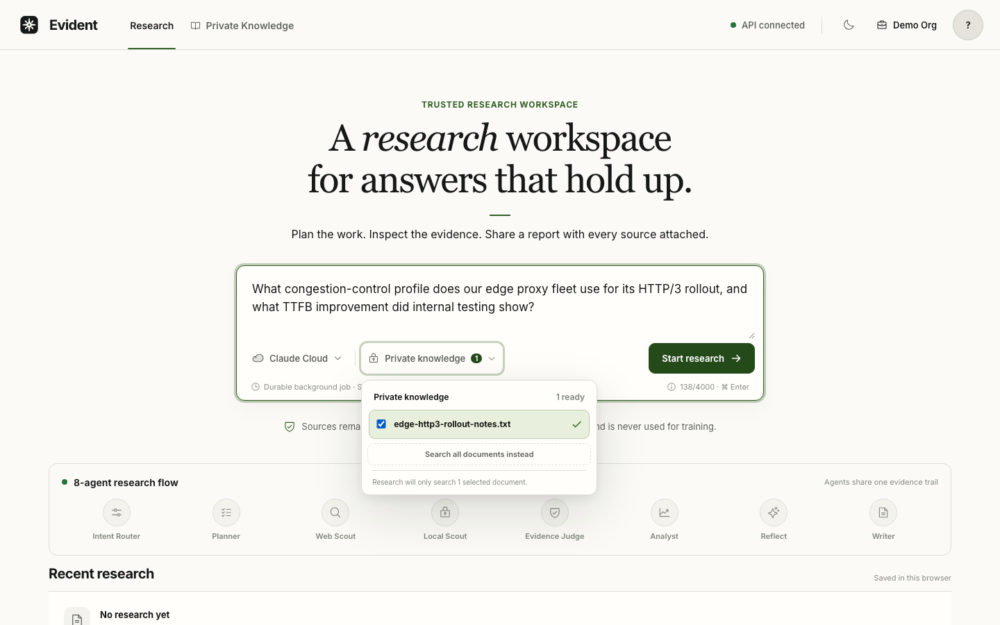
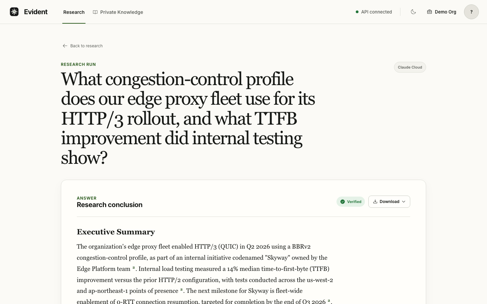
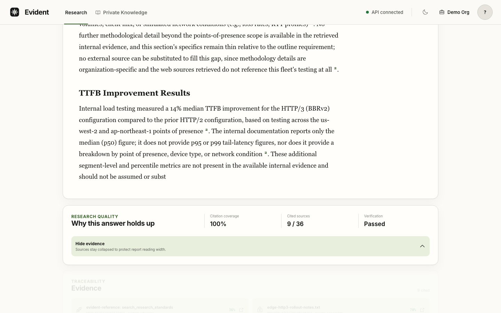

# Enterprise Agentic Research Platform

A general-purpose enterprise research platform for evidence-backed questions
across technical, business, policy, market, and internal-knowledge domains.

The product is domain-neutral. Backend, infrastructure, cloud, networking,
database, and distributed-systems questions are used as the primary demo and
evaluation dataset because they provide concrete, technically demanding
research scenarios — but the routing, retrieval, evidence, and
report-writing code never hard-codes engineering vocabulary.

Built with FastAPI, LangGraph, Claude, Qwen through Ollama, Tavily, Semantic
Scholar, PostgreSQL, Redis, Milvus, MCP, Vue, Docker, and AWS.

## Key Features

- **Eight-agent research workflow** (LangGraph): Intent Router → Planner →
  Web Scout / Local Scout → Evidence Judge → Analyst → Reflect → Writer,
  with a fast direct-answer branch for simple questions.
- **Choice of LLM provider per request** — Claude through Anthropic, or a
  local Qwen model through Ollama — persisted with the research run, not
  just a global setting.
- **Three-way evidence retrieval**: public web search (Tavily), academic
  literature (Semantic Scholar, with author/year/venue metadata), and
  tenant-scoped private-document search (Milvus RAG) — merged, deduplicated
  across providers, and scored together.
- **Evidence scoring and citation validation**: every source is quality-,
  relevance-, and freshness-scored; conflicting evidence and unsupported
  claims are flagged; citations are checked against the actual source pool
  before a report is returned.
- **High-risk domain detection** (medical, legal, financial,
  safety/security) that forces a human-review flag regardless of citation
  quality.
- **Durable, resumable execution**: research runs, agent steps,
  checkpoints, and worker leases are persisted in PostgreSQL, so a crashed
  worker resumes from its last checkpoint instead of restarting.
- **Real-time progress** over Server-Sent Events, backed by Redis for
  caching, idempotency, coordination locks, and rate limiting.
- **Report export** to Markdown or PDF, with numbered or footnote citation
  styles and a real References/Notes list.
- **Vue 3 console** with authentication, a private-knowledge-base manager,
  and a live view of the agent workflow as a run executes.
- **MCP tool server** exposing search, retrieval, ingestion, and report
  tools to other agents or clients over Streamable HTTP.
- **Reproducible evaluation harness** for routing, citation integrity,
  unsupported claims, independent-source diversity, private-knowledge use,
  latency, provider token usage, and explicitly priced per-run API cost.

## Demo

Recorded against the real AWS staging deployment (not a local mock) for
`Compare HTTP/2 and HTTP/3 using current technical sources.`, routed through
Claude and the full eight-agent workflow end to end. Live at
[d5llhn72jopyp.cloudfront.net](https://d5llhn72jopyp.cloudfront.net) when the
staging stack is up — see [Deployment](#deployment) below; it's
demo-on-demand, not always-on, so the URL may be down between reviews.

<p>
  
  
</p>
<p>
  
  
</p>

Full screen recording: [frontend/artifacts/demo/demo.mp4](frontend/artifacts/demo/demo.mp4).

**Private Knowledge.** A second recording against the same live deployment
covers the path the first one doesn't: uploading a private document (through
the real Bedrock Titan V2 embedding pipeline, not a mock), scoping a research
run to it, and getting back a report that cites it correctly — including
telling apart the private source from unrelated public results for the same
search terms.

<p>
  
  
</p>
<p>
  
</p>

Full screen recording: [frontend/artifacts/demo/private-knowledge/demo.mp4](frontend/artifacts/demo/private-knowledge/demo.mp4).

## Architecture

```text
User question
  → Intent Router (direct answer, or deep research)
  → Planner (deep research only)
  → parallel retrieval: Tavily + Semantic Scholar (public) / Milvus (private) / MCP (external tools)
  → evidence normalization, scoring, and conflict detection
  → Analyst → Reflect (bounded supplementary-research loop) → Writer
  → PostgreSQL persistence + SSE progress to the Vue console
```

```text
PostgreSQL → durable business data (runs, reports, sources, sessions,
             worker leases, audit events, checkpoints)
Redis      → temporary cache, progress, rate limiting, idempotency
Milvus     → private document chunks, embeddings, tenant-scoped search
```

See [docs/architecture.md](docs/architecture.md) for the full component
diagram and request-flow detail, [docs/workflow.md](docs/workflow.md) for
the agent-by-agent research path, and
[docs/data-model.md](docs/data-model.md) for the PostgreSQL schema.

## Getting Started

**Local (Python + Node):**

```bash
python3.13 -m venv .venv
source .venv/bin/activate
python -m pip install -e ".[dev]"
cp .env.example .env   # add only the credentials for the integrations you intend to run
uvicorn app.main:app --reload
```

PDF rendering uses WeasyPrint and therefore needs native Pango libraries in
addition to the Python package. On macOS, install the official Homebrew
package before running the complete backend suite. If Homebrew's libraries
are not discovered automatically, expose its library directory for the
current shell:

```bash
brew install weasyprint
export DYLD_FALLBACK_LIBRARY_PATH="$(brew --prefix)/lib${DYLD_FALLBACK_LIBRARY_PATH:+:$DYLD_FALLBACK_LIBRARY_PATH}"
python -m weasyprint --info
```

```bash
cd frontend
npm install
npm run dev
```

**Docker Compose (one command, eight services):**

```bash
cp .env.example .env
docker compose up --build --detach --wait
```

Open `http://localhost:3000`. See
[docs/deployment.md](docs/deployment.md#local) for the full port topology
and the `scripts/compose-smoke.sh` verification script.

## Usage

Every research endpoint requires an authenticated session — there is no
client-supplied identity header. `POST /auth/register` creates a tenant and
its first user in one transaction (self-service signup, no invite system
yet) and returns a session cookie; `POST /auth/login` authenticates an
existing user the same way. The cookie is `httpOnly`, `SameSite=Lax`, and
`Secure` outside development, backed by Argon2id-hashed passwords and a
durable `sessions` table with a fixed 7-day expiry. See
[docs/security.md](docs/security.md) for what is and is not implemented
(no email verification, password reset, or MFA yet).

```bash
curl -c cookies.txt -X POST http://127.0.0.1:8000/auth/register \
  -H 'Content-Type: application/json' \
  -d '{"email": "engineer@example.com", "password": "correct-horse-battery", "tenant_name": "Example Corp"}'

curl -b cookies.txt -X POST http://127.0.0.1:8000/research-runs \
  -H 'Content-Type: application/json' \
  -H 'Idempotency-Key: research-request-001' \
  -d '{"query": "What is a mutex?", "llm_provider": "qwen"}'
```

```text
GET  /research-runs                        → tenant-scoped recent-run history
GET  /research-runs/{run_id}               → one run's durable lifecycle state
GET  /research-runs/{run_id}/report        → durable report content and citations
POST /research-runs/{run_id}/report/export → snapshot the report to object storage
                                              (?format=markdown|pdf&citation_style=numbered|footnote)
GET  /research-runs/{run_id}/report/export → download a previously exported snapshot
GET  /research-runs/{run_id}/sources       → tenant-scoped scored evidence
POST /research-runs/jobs                   → submit the same request asynchronously (202 + polling/SSE URLs)
GET  /providers                            → Claude/Qwen capability metadata
GET  /health, GET /ready                   → liveness and PostgreSQL/Redis readiness
```

Redis result caching and rate limiting fail open when Redis is unavailable;
requests carrying an explicit `Idempotency-Key` instead fail closed, since
idempotency cannot be guaranteed without it. Rate-limit headers report the
current limit, remaining allowance, and reset delay.

## Testing

```bash
ruff check .
mypy app tests scripts alembic/env.py alembic/versions
pytest -q
```

The same backend suite can be reproduced without installing native PDF
libraries on the host. The dedicated Docker test stage contains the exact
Linux libraries used by the production image and CI:

```bash
docker build --target test --tag evident-backend-test .
docker run --rm evident-backend-test
```

```bash
cd frontend
npm run lint && npm run format:check && npm run typecheck && npm test && npm run build && npx playwright test
```

The default suites use mocks only — no Claude, Tavily, Ollama, Milvus,
PostgreSQL, or Redis calls. Live integration tests exercise the real
services and are opt-in via `RUN_LIVE_TESTS=true`, e.g.:

```bash
ANTHROPIC_API_KEY=... ANTHROPIC_MODEL=claude-sonnet-5 RUN_LIVE_TESTS=true \
  pytest -q -m integration tests/integration/test_anthropic_live.py
```

`tests/integration/` has one file per live path (Tavily, Ollama
LLM/embeddings, Milvus, PostgreSQL, Redis, MCP, durability, checkpoint
resume); point `pytest -q -m integration` at a specific file, or drop the
argument to run everything the configured environment supports.

GitHub Actions gates every pull request and push to `main` with backend
(Ruff, mypy, pytest), frontend (typecheck, Vitest, Playwright, build),
PostgreSQL+Redis integration, Terraform, and container-packaging jobs — see
[docs/deployment.md](docs/deployment.md#cicd). The latest verified pass
counts for both suites are tracked in [docs/status.md](docs/status.md).

## Deployment

The application stack (ECS, RDS, Valkey, ALB, CloudFront) has been applied
and verified live — see the [Demo](#demo) section above. Deployment is
demo-on-demand rather than always-on: apply for an active review, verify the
endpoint, then destroy, since the running stack costs real money for as long
as it's up (see [docs/deployment.md](docs/deployment.md#aws-staging) for the
cost breakdown).

```bash
# Deploy (after configuring the staging backend and required secrets):
TF_VAR_budget_notification_email=you@example.com \
TF_VAR_anthropic_model=replace-with-supported-model-id \
TF_VAR_milvus_uri=https://replace-with-managed-milvus-endpoint \
ANTHROPIC_API_KEY=... TAVILY_API_KEY=... MILVUS_TOKEN=... \
scripts/aws-deploy.sh

# Destroy (billable resources only — the state bucket survives):
AWS_DESTROY_CONFIRM=destroy-staging scripts/aws-destroy.sh
```

See [docs/deployment.md](docs/deployment.md#aws-staging) for the Terraform
root breakdown, full cost basis, and what each script does.

## Documentation

| Document | Covers |
| --- | --- |
| [docs/PROJECT_CHARTER.md](docs/PROJECT_CHARTER.md) | Target-state product vision and scope (assumes all phases complete) |
| [docs/architecture.md](docs/architecture.md) | Component diagram and request-flow detail |
| [docs/workflow.md](docs/workflow.md) | The eight-agent research path and routing logic |
| [docs/data-model.md](docs/data-model.md) | PostgreSQL schema and ERD |
| [docs/deployment.md](docs/deployment.md) | Docker Compose topology and AWS staging deployment |
| [docs/reliability.md](docs/reliability.md) | Retry, circuit-breaker, and failure-isolation mechanisms |
| [docs/security.md](docs/security.md) | Authentication, tenant isolation, and secrets handling |
| [docs/evaluation.md](docs/evaluation.md) | The evaluation harness and every published run's findings |
| [docs/trade-offs.md](docs/trade-offs.md) | Named architectural trade-off decisions and why |
| [docs/status.md](docs/status.md) | Component-by-component verification status, build log, and latest test-run snapshots |

## Engineering Principles

- Keep provider-specific SDK types behind application interfaces.
- Validate structured and external responses before using them.
- Validate complete vector batches before mutation.
- Enforce tenant isolation inside vector queries and deletion filters.
- Use deterministic mocks for default unit tests.
- Keep paid and external integration tests explicitly opt-in.
- Record only metrics that were produced by reproducible evaluation runs.
- Do not describe planned, mocked, or local-only features as production
  capabilities.
