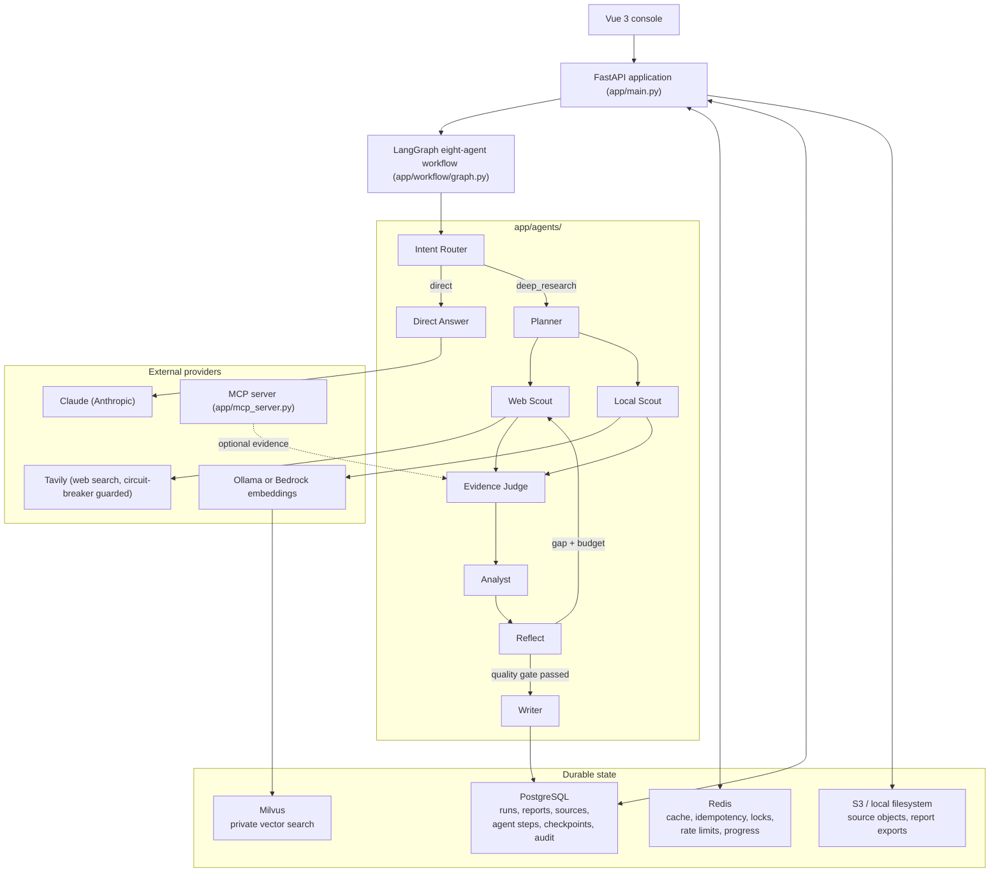

# Architecture

See [PROJECT_CHARTER.md](PROJECT_CHARTER.md) for the target-state vision and
the root [README.md](../README.md) for the current, verified implementation
status. This document describes how the pieces fit together.

## Component overview

## Request paths

**Synchronous:** `POST /research-runs` — validates the request, persists a
queued run, executes the LangGraph workflow outside the database
transaction, then atomically marks the run completed or failed.

**Asynchronous (durable):** `POST /research-runs/jobs` — commits the queued
run and returns `202` immediately with progress/events/report URLs. A
`ResearchJobManager` claims the run with a PostgreSQL worker lease, runs it
in an owned asyncio task, renews the lease on a heartbeat, and writes
checkpoints/audit events at node boundaries so another process can resume
after a crash (`app/services/research/jobs.py`,
`app/db/repositories/durability.py`).

Every HTTP request carries a correlation ID (`app/core/correlation.py`):
reused from an `X-Correlation-ID` header when safe to log, otherwise
generated, attached to every log line for that request, and echoed back in
the response.

## The eight-agent workflow

`app/workflow/graph.py` compiles a LangGraph `StateGraph` over
`ResearchState` (`app/workflow/state.py`). Intent Router and Planner are
domain-neutral (`app/agents/intent_router.py`, `app/agents/planner.py`): no
routing decision or report-outline choice depends on engineering-specific
vocabulary. Web Scout and Local Scout run in parallel; their output is
merged by Evidence Judge before Analyst produces structured findings.
Reflect can request one bounded supplementary retrieval round, and now also
flags `human_review_required` whenever the Intent Router detected a
medical/legal/financial/safety-critical domain — independent of whether the
report's citations are otherwise sufficient to approve it. Writer performs a
bounded citation-repair loop before returning.

## MCP boundary

`app/mcp_server.py` runs a separate Streamable HTTP MCP server exposing the
platform's own capabilities as tools (`app/services/mcp/tools.py`):
`search_web`, `search_private_documents`, `retrieve_source`,
`ingest_document`, `save_research_report`, `get_research_history`, and
`request_human_review`, alongside a demo `search_research_standards` tool.
Each capability is constructed independently at startup; a missing
credential (Tavily key, embedding/vector-store configuration) disables only
that tool rather than the whole server.

## Reliability primitives

- **Circuit breaker** (`app/core/circuit_breaker.py`): closed/open/half-open
  state machine wired into `SearchExecutor` around Tavily calls, so a
  failing search provider stops being hammered mid-run instead of every
  remaining task paying its own timeout to find out independently.
- **Worker leases, heartbeats, and checkpoints**: durable background
  execution survives process restarts (`app/services/research/jobs.py`).
- **Idempotency and rate limiting**: Redis-backed, fail-closed for
  correctness-critical paths, fail-open for pure acceleration (result
  cache, progress publishing).

See [reliability.md](reliability.md) for the full picture and
[data-model.md](data-model.md) for the PostgreSQL schema.
