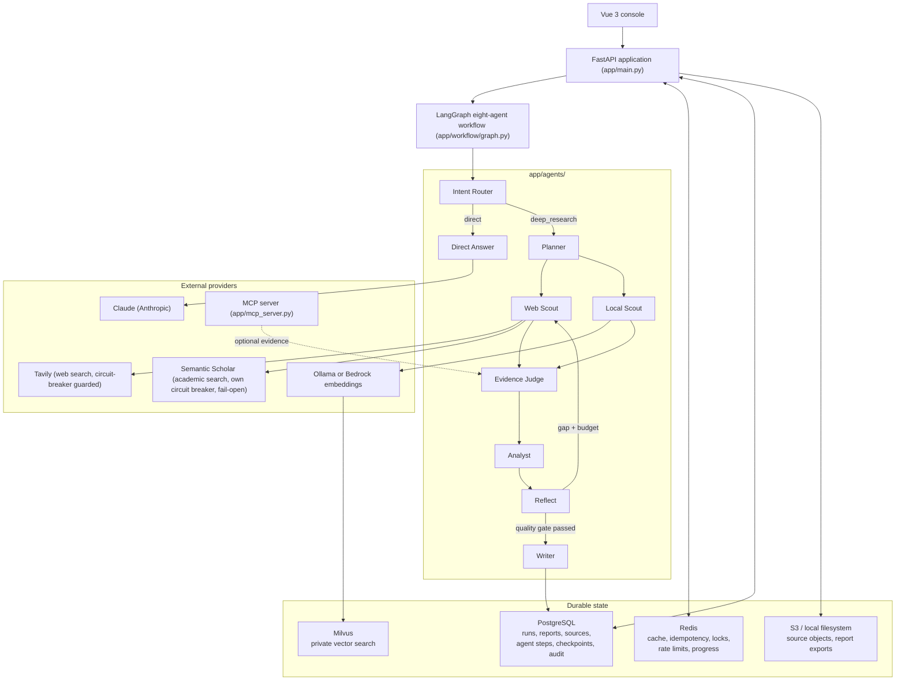

# Architecture

See [PROJECT_CHARTER.md](PROJECT_CHARTER.md) for the target-state vision and
the root [README.md](../README.md) for the current, verified implementation
status. This document describes how the pieces fit together.

## Component overview



## Request paths

Every endpoint below requires an authenticated session — see
[security.md](security.md) for the login/session model.

**Synchronous:** `POST /research-runs`

```text
validate query and user-facing provider
→ normalize claude/qwen to anthropic/ollama
→ persist queued run
→ atomically mark running
→ execute LangGraph outside the database transaction
→ close provider-owned HTTP resources
→ atomically mark completed or failed
→ return run ID, provider, route, status, and answer
```

**Asynchronous (durable):** `POST /research-runs/jobs`

```text
validate tenant, user, provider, and rate limit
→ commit the queued PostgreSQL row
→ return HTTP 202 with progress, events, and report URLs
→ atomically claim the run with an expiring PostgreSQL worker lease
→ write the queued checkpoint and worker audit event
→ run the remaining lifecycle in an owned asyncio task
→ renew ownership on a bounded heartbeat
→ write the terminal checkpoint and audit event
→ release only with the matching worker identity and lease token
→ POST /research-runs/{run_id}/cancel interrupts locally owned work
→ atomically mark only queued/running rows cancelled within the tenant
  boundary; the console offers cancellation only while a job is queued
  or running, so a late client request never reports a completed result
  as cancelled
→ publish cancelled as a terminal Redis snapshot and SSE event
```

`ResearchJobManager` claims the run with a PostgreSQL worker lease, runs it
in an owned asyncio task, renews the lease on a heartbeat, and writes
checkpoints/audit events at node boundaries (`app/services/research/jobs.py`,
`app/db/repositories/durability.py`). PostgreSQL coordinates ownership
across processes: the application scans queued/running rows without an
active lease on startup and atomically claims them, and the official
asynchronous LangGraph PostgreSQL checkpointer saves every graph superstep
and pending parallel writes under a tenant/run thread ID, so recovery
continues after the last successful node without repeating it. A separate
queue service could improve dispatch throughput, but it is not required
for correctness after an API process restart — worker-lease ownership
already covers that. Normal application shutdown only interrupts local
tasks and leaves their active rows recoverable; it does not impersonate an
explicit user cancellation.

Every HTTP request carries a correlation ID (`app/core/correlation.py`):
reused from an `X-Correlation-ID` header when safe to log, otherwise
generated, attached to every log line for that request, and echoed back in
the response.

### Redis-backed result caching

```text
POST /research-runs
→ create a durable PostgreSQL research run
→ look up tenant + canonical provider + normalized query in Redis
→ cache hit: restore API-visible state and skip the LLM workflow
→ cache miss: execute the workflow and commit the completed run
→ preserve report, evidence, citation, and reflection state on either path
→ write the completed result to Redis with a bounded TTL
→ return cache_hit in the API response
```

Redis is an optional acceleration layer: read/write failures are logged
and fail open, while PostgreSQL remains the durable source of truth. Cache
hits still create distinct research-run records for auditability.

### Idempotent request coordination

```text
POST /research-runs with Idempotency-Key
→ normalize the tenant-scoped client key and request payload
→ read a completed idempotency record
→ acquire an expiring Redis lock when no record exists
→ read the completed record again after acquiring the lock
→ execute at most once while the lease is held, renewing it on a
  heartbeat for executions that outlive the lock's own TTL
→ store the completed response for later replay
→ release with an atomic compare-and-delete Lua script
```

Idempotency is a correctness feature, not an optional acceleration:
requests carrying `Idempotency-Key` fail closed with `503` when the Redis
record store or coordination lock is unavailable. Reusing a key for a
different payload, or retrying while its original request is still
running, returns `409`. A completed retry returns the original
research-run ID without creating another run.

### Tenant-scoped rate limiting

```text
POST /research-runs
→ derive a versioned tenant-scoped Redis key
→ atomically increment the request counter with Lua
→ initialize a bounded TTL for the fixed window
→ allow requests within the configured tenant allowance
→ return HTTP 429 and Retry-After when the allowance is exhausted
→ expose X-RateLimit-Limit, Remaining, and Reset headers
```

The default policy allows 20 research requests per tenant per 60-second
window (both configurable). Rate limiting fails closed with `503` when
Redis cannot guarantee enforcement, protecting the LLM-backed endpoint
from unbounded work during a coordination outage.

### Research progress coordination

```text
ResearchExecutionService
→ publish queued after durable run creation
→ publish running after the PostgreSQL transition
→ publish completed with the final workflow status
→ publish failed with a bounded error message
→ expire the latest snapshot with a configurable Redis TTL
```

Clients poll `GET /research-runs/{research_run_id}/progress` or consume
`GET /research-runs/{research_run_id}/events` with a valid session cookie;
the SSE stream emits changed snapshots and closes after `completed` or
`failed`. Keys include both the tenant UUID and research-run UUID, so
another tenant cannot read the snapshot. Progress publishing fails open to
preserve durable research execution when Redis is unavailable; query and
stream consumers get an explicit unavailable or not-found result.

## The eight-agent workflow

`app/workflow/graph.py` compiles a LangGraph `StateGraph` over
`ResearchState` (`app/workflow/state.py`). Intent Router and Planner are
domain-neutral (`app/agents/intent_router.py`, `app/agents/planner.py`): no
routing decision or report-outline choice depends on engineering-specific
vocabulary. Web Scout and Local Scout run in parallel; their output is
merged by Evidence Judge before Analyst produces structured findings.
Reflect can request one bounded supplementary retrieval round, and now also
flags `human_review_required` whenever the Intent Router detected a
medical/legal/financial/safety-critical domain — independent of whether the
report's citations are otherwise sufficient to approve it. Writer performs a
bounded citation-repair loop before returning.

## Provider boundaries

```text
LLMClient
├── Claude
└── Qwen through Ollama

EmbeddingClient
├── Deterministic test embeddings
├── Qwen embeddings through Ollama
└── Amazon Titan Text Embeddings V2 through Bedrock

DocumentStorage
├── private local filesystem
└── private Amazon S3 bucket

VectorStore
├── InMemoryVectorStore
└── MilvusVectorStore
```

Unit tests use mocks, deterministic providers, and the in-memory vector
store; real external integrations are opt-in (`@pytest.mark.integration`).

## Private knowledge retrieval

```text
Private document
→ POST /documents with an authenticated session
→ bounded multipart read and TXT, Markdown, or PDF validation
→ atomic source-object write
→ short PostgreSQL pending transaction
→ indexing lifecycle transition
→ deterministic chunks
→ embedding provider
→ vector-store provider
→ ready or failed PostgreSQL lifecycle state
→ GET /documents and GET /documents/{document_id}
→ tenant-scoped similarity search
→ stable PRIVATE-* sources
→ DELETE /documents/{document_id}
→ vector, source-object, and metadata cleanup
```

The long-running embedding and vector calls execute outside PostgreSQL
transactions; PostgreSQL records each short lifecycle transition, while the
source object and vector records remain provider-owned artifacts.
Duplicate normalized content is rejected per tenant. Local development
uses a private runtime directory and Ollama embeddings; AWS staging
selects S3 and Bedrock through the same application interfaces.

## MCP boundary

`app/mcp_server.py` runs a separate Streamable HTTP MCP server exposing the
platform's own capabilities as tools (`app/services/mcp/tools.py`):
`search_web`, `search_private_documents`, `retrieve_source`,
`ingest_document`, `save_research_report`, `get_research_history`, and
`request_human_review`, alongside a demo `search_research_standards` tool.
Each capability is constructed independently at startup; a missing
credential (Tavily key, embedding/vector-store configuration) disables only
that tool rather than the whole server.

The client (`StreamableHTTPMCPClient`) implements the JSON-response subset
of [MCP protocol revision 2025-11-25](https://modelcontextprotocol.io/specification/2025-11-25)
over the existing `httpx` dependency: it negotiates the protocol version,
sends `notifications/initialized`, preserves MCP session/protocol headers,
follows `tools/list` cursor pagination, distinguishes JSON-RPC protocol
errors from tool-execution errors, and terminates the session cleanly. Its
lifecycle, headers, pagination, tool-call results, error handling, and
cleanup are contract tested with a deterministic HTTP transport, and
client/server interoperability against the repository's own official-SDK
server is tested both in-process and through a live loopback TCP
subprocess. Compose runs it as an internal service; AWS Terraform declares
it as an API-image sidecar. Web Scout federates successful MCP results as
additional evidence and fails open when the optional server or tool is
unavailable.

## Reliability primitives

- **Circuit breaker** (`app/core/circuit_breaker.py`): closed/open/half-open
  state machine wired around Tavily (`SearchExecutor`), the Anthropic
  client, and `MilvusVectorStore.search()`, so a failing dependency stops
  being hammered mid-run instead of every remaining call paying its own
  timeout to find out independently. `AcademicAwareSearchClient`
  (`app/services/search/composite.py`) wraps the Semantic Scholar leg with
  its own separate breaker: the two search providers fail independently, so
  a persistently unavailable Semantic Scholar never blocks or slows down
  Tavily results.
- **Exponential backoff with jitter** (`app/core/retry.py`): layered
  outside the circuit breaker around each client's actual
  connectivity-level exceptions (not Anthropic, whose SDK already retries
  internally).
- **Worker leases, heartbeats, and checkpoints**: durable background
  execution survives process restarts (`app/services/research/jobs.py`).
- **Idempotency and rate limiting**: Redis-backed, fail-closed for
  correctness-critical paths, fail-open for pure acceleration (result
  cache, progress publishing).

See [reliability.md](reliability.md) for the full picture,
[trade-offs.md](trade-offs.md) for why retry wraps the breaker and not the
reverse, and [data-model.md](data-model.md) for the PostgreSQL schema.
