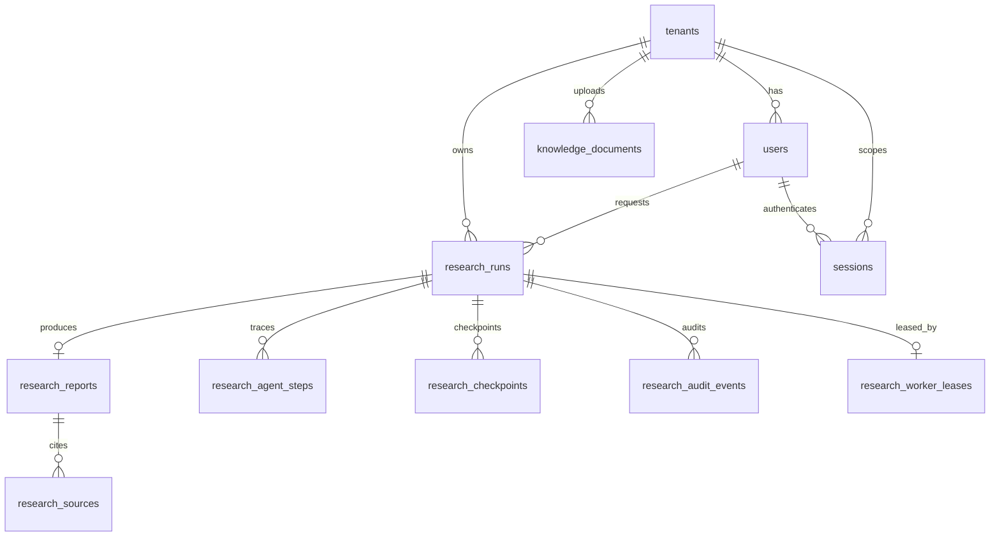

# Data Model

## PostgreSQL



| Table | Purpose | Added in |
|---|---|---|
| `tenants`, `users` | Tenant/user identity — `users.password_hash` (Argon2id) and a global `users.email` uniqueness constraint were added alongside `sessions` | Phase 8; extended this session |
| `sessions` | Durable login sessions: `token_hash` (SHA-256 of the raw cookie value, never stored raw), `expires_at`, nullable `revoked_at` for explicit logout | Added this session |
| `research_runs` | One durable workflow execution: query, provider, route, status, timestamps | Phase 8 |
| `research_reports` | One completed report per run (unique on `research_run_id`), with citation/reflection summary columns | Phase 11 |
| `research_sources` | Scored evidence rows attached to a report | Phase 11 |
| `research_checkpoints` | Application-level node-boundary state snapshots, ordered by `sequence` | Phase 14 (durability) |
| `research_audit_events` | Append-only operational events (`event_type`, `actor_type`, `details` JSONB) — worker ownership *and* `human_review_requested` events from the MCP tool | Phase 14; extended this session |
| `research_worker_leases` | One active lease per run, with heartbeat/expiry, for crash-safe background execution | Phase 14 |
| `research_agent_steps` | Per-agent-role started/completed/failed trace (`agent_role`, `status`, `sequence`) for the eight-agent workflow, written live via `LangGraphResearchWorkflow`'s `astream` reconstruction | Added this session |
| `knowledge_documents` | Private-document upload/indexing lifecycle metadata | Phase 7 |

LangGraph's official `AsyncPostgresSaver` also owns four of its own tables
(`checkpoints`, `checkpoint_blobs`, `checkpoint_writes`,
`checkpoint_migrations`), migrated by the checkpointer itself and
intentionally excluded from Alembic's schema-drift checks.

## Redis

Namespaced by tenant and, where applicable, provider/query or run ID:
result cache (bounded TTL, fail-open), idempotency records and locks
(fail-closed), fixed-window rate limiting (fail-closed), and progress
snapshots for polling/SSE (fail-open). See `app/services/cache/`.

## Milvus

One collection per deployment, tenant-scoped via a `tenant_id` filter on
every search/delete. Chunks carry deterministic `PRIVATE-*` source IDs
derived from document and chunk identity. See
`app/services/vector_store/milvus.py`.

## Object storage (S3 or local filesystem)

Two independent key namespaces under the same `DocumentStorage` interface
(`app/services/storage/`):

```text
tenants/{tenant_id}/documents/{document_id}/source{suffix}   — uploaded source documents
tenants/{tenant_id}/report-exports/{research_run_id}/report.md — report export snapshots
```

Report exports (`app/services/research/exports.py`) are immutable snapshots
of an already-persisted report, distinct from the live `research_reports`
database row — useful for sharing or download outside the API. As of this
writing the export service is implemented and tested; the REST endpoint to
trigger an export is pending (see the root README's current status).
